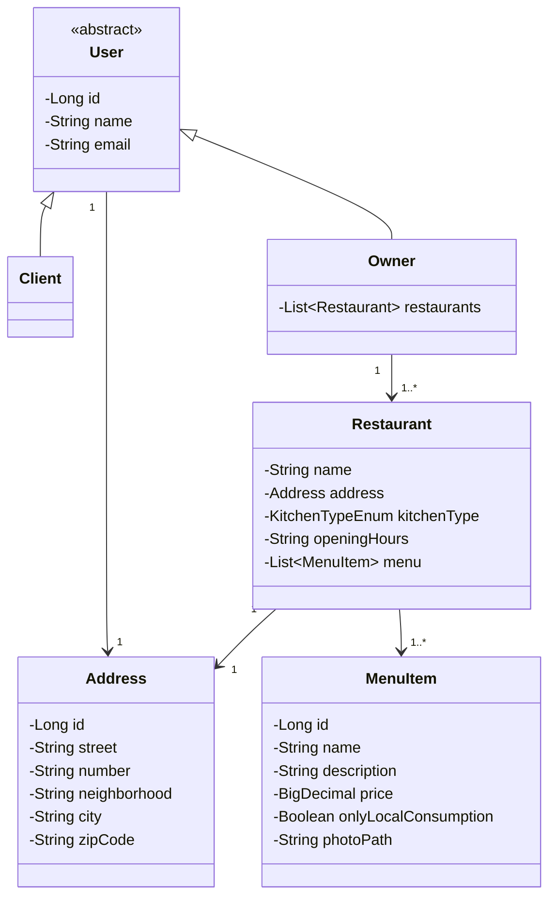
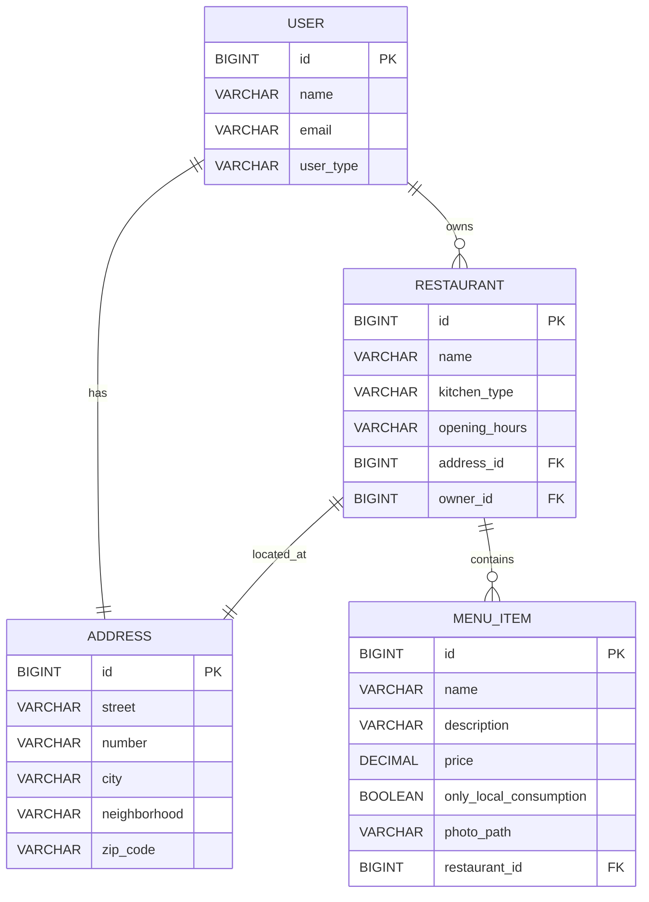

# Tech Challenge II
## 📌Sobre este projeto

Este repositório é um fork de um projeto desenvolvido em equipe como parte do Tech Challenge II da Pós-Graduação em Arquitetura e Desenvolvimento Java (FIAP).

**Repositório original:**  
https://github.com/HugoOliveiraSoares/tech-challenge-ii

## Minhas contribuições

Atuei principalmente no desenvolvimento do módulo de **Restaurant**, sendo responsável por:

- Implementação completa do CRUD de restaurantes  
- Desenvolvimento de endpoints REST (`POST`, `GET`, `PATCH`, `DELETE`)  
- Modelagem de entidades e relacionamento com Address (JPA)  
- Implementação de Use Cases seguindo os princípios de Clean Architecture  
- Integração com camada de persistência (Spring Data JPA)  
- Aplicação de validações de negócio e tratamento de exceções  
- Escrita de testes unitários com Mockito  
- Escrita de testes de integração com MockMvc

## Trabalho em equipe

Este projeto foi desenvolvido em colaboração com:

- [Hugo Soares](https://github.com/HugoOliveiraSoares)
- [Matheus Sousa](https://github.com/msousa-s)  

Utilizando fluxo baseado em Git (feature branches, pull requests e code review).
  
## Introdução

Este projeto consiste no desenvolvimento de uma API backend para gestão de usuários, restaurantes e itens de cardápio em uma plataforma compartilhada entre restaurantes.

O sistema foi desenvolvido como parte do Tech Challenge – Fase 2 do programa de Pós-Graduação em Arquitetura e Desenvolvimento Java (FIAP), com foco na aplicação prática dos conceitos estudados ao longo do curso.

### Objetivo do projeto

- Desenvolver uma API REST para gerenciamento de usuários, restaurantes e itens de cardápio  
- Implementar operações CRUD para os módulos de User, Restaurant e Menu  
- Aplicar os princípios de Clean Architecture para promover separação de responsabilidades, baixo acoplamento e alta coesão entre as camadas da aplicação
- Garantir qualidade de código com testes unitários e de integração
- Utilizar PostgreSQL como banco de dados relacional  
- Containerizar a aplicação utilizando Docker  

## Arquitetura do Sistema

### Descrição da Arquitetura

A aplicação segue os princípios de Clean Architecture, sendo organizada em módulos: User, Restaurant e Menu.

A estrutura é dividida em camadas principais, com isolamento entre domínio e infraestrutura:

- **Core (Domínio):** Responsável pelas regras de negócio, independente de frameworks:

    - domain → entidades e regras
    - usecase → lógica da aplicação
    - gateway → interfaces (contratos)
    - exception → exceções de domínio

- **Infra (Infraestrutura):** Responsável pelos detalhes técnicos:

    - controller → endpoints REST
    - persistence → acesso ao banco de dados (JPA)
    - entity → mapeamento JPA

  Essa separação garante baixo acoplamento, alta testabilidade e facilidade de manutenção e evolução.

### Diagrama da Arquitetura

#### Diagrama de classes (domain)



#### Diagrama de entidades



## API – Endpoints

### Tabela de Endpoints

### - User

| Endpoint        | Método | Descrição                |
|----------------|--------|--------------------------|
| /users         | POST   | Criar usuário            |
| /users/{id}    | GET    | Obter usuário por ID     |
| /users         | GET    | Listar usuários          |
| /users/{id}    | PUT    | Atualizar usuário        |
| /users/{id}    | DELETE | Excluir usuário          |

---

### - Restaurant

| Endpoint            | Método | Descrição                     |
|--------------------|--------|-------------------------------|
| /restaurants       | POST   | Criar restaurante             |
| /restaurants/{id}  | GET    | Obter restaurante por ID      |
| /restaurants       | GET    | Listar restaurantes           |
| /restaurants/{id}  | PATCH  | Atualizar restaurante         |
| /restaurants/{id}  | DELETE | Excluir restaurante           |

---

### - Menu

| Endpoint                                   | Método | Descrição                     |
|--------------------------------------------|--------|-------------------------------|
| /menu/{restaurantId}                       | POST   | Adicionar itens ao menu       |
| /menu/                                     | GET    | Obter todos os menus          |
| /menu/{restaurantId}                       | GET    | Obter menu do restaurante     |
| /menu/{restaurantId}/{menuItemId}          | PUT    | Atualizar item do menu        |
| /menu/{restaurantId}/{menuItemId}          | DELETE | Excluir item do menu          |

### Exemplos de Requisição e Resposta

### Criar usuário
 
**Request**

```JSON
POST /users

{
    "email": "joao@teste.com",
    "name": "João",
    "type": "OWNER"  
}
```

**Response - Sucesso**

```JSON
{    
    "id": 1,    
    "name": "João",    
    "email": "joao@teste.com",    
    "userType": "OWNER",    
    "restaurants": null
}
```
### Update User

**Request**

```JSON
PUT /users/1

{
    "name": "Joao Pedro",
    "userType": "OWNER"  
}
```

### Criar Restaurant

**Request**

```JSON
POST /restaurants
Header: x-user-id: 1

{
    "name": "Bean Burger",
    "address": {
        "id": null,
        "street": "Avenida Paulista",
        "number": "1000",
        "neighborhood": "Bela Vista",
        "city": "Sao Paulo",
        "zipCode": "12345-123"
    },
    "kitchenType": "Brazilian",
    "openingHours": "seg-sab: 10:00 - 23:59, dom: 10:00 - 21:59"
}
```

**Response - Sucesso**

```JSON
{
    "id": 1,
    "name": "Bean Burger",
    "kitchenType": "BRAZILIAN"
}
```

**Erro: Usuário não é do tipo Owner**

```JSON
{
    "type": "https://api.example.com/errors/restaurant.actionNotAllowed",
    "title": "restaurant.actionNotAllowed",
    "status": 403,
    "detail": "Only users with OWNER role can create restaurants",
    "instance": "/restaurants",
    "code": "restaurant.actionNotAllowed",
    "timestamp": "2026-03-24T17:04:50.664821775Z"
}
```

### Atualizar tipo de cozinha

**Request**

```JSON
PATCH /restaurants/1
Header: x-user-id: 1

{
    "kitchenType": "Italia"
}
```

**Erro - Tipo de cozinha inválido**

```JSON
{
    "type": "https://api.example.com/errors/restaurant.invalidRequest",
    "title": "restaurant.invalidRequest",
    "status": 400,
    "detail": "Invalid kitchen type value: Italia",
    "instance": "/restaurants/1",
    "code": "restaurant.invalidRequest",
    "timestamp": "2026-03-24T17:07:12.073776365Z"
}
```
### Criar Item do Menu

**Request**

```JSON
POST /menu/1
Header: x-user-id: 1

[
    {
        "name": "Burger",
        "description": "Delicious burger",
        "price": 25.90,
        "isOnlyLocalConsumption": false,
        "photoPath": "/photos/burger.jpg"
    },
    {
        "name": "Fries",
        "description": "Delicious fries",
        "price": 5.90,
        "isOnlyLocalConsumption": false,
        "photoPath": "/photos/fries.jpg"
    }
]
```

**Response - Sucesso**

```JSON
{
    "ids": [1, 2]
}
```
**Erro - Item ja existente**

```JSON
{
    "type": "https://api.example.com/errors/user.actionNotAllowed",
    "title": "user.actionNotAllowed",
    "status": 400,
    "detail": "Item with this name already exists",
    "instance": "/menu/1",
    "code": "user.actionNotAllowed",
    "timestamp": "2026-03-24T18:03:31.314716661Z"
}
```
**Erro - Usuário não é o dono do restaurante**

```JSON
{
    "type": "https://api.example.com/errors/user.actionNotAllowed",
    "title": "user.actionNotAllowed",
    "status": 403,
    "detail": "Action not allowed",
    "instance": "/menu/1",
    "code": "user.actionNotAllowed",
    "timestamp": "2026-03-24T18:06:16.983010272Z"
}
```
### Atualizar Item do Menu

**Request**

```JSON
PUT /menu/1/1
Header: x-user-id: 1

{
    "name": "X-Burger",
    "description": "Delicious x-burger",
    "price": 29.90,
    "isOnlyLocalConsumption": false,
    "photoPath": "/photos/xburger.jpg"
}
```

**Response - Sucesso**

```JSON
{
    "name": "X-Burger",
    "description": "Delicious x-burger",
    "price": 29.90,
    "isOnlyLocalConsumption": false,
    "photoPath": "/photos/xburger.jpg",
    "restaurantId": 1
}
```
**Erro - Item não encontrado**

```JSON
{
    "type": "https://api.example.com/errors/menuItem.menuItemNotFound",
    "title": "menuItem.menuItemNotFound",
    "status": 404,
    "detail": "Menu Item not found",
    "instance": "/menu/1/5",
    "code": "menuItem.menuItemNotFound",
    "timestamp": "2026-03-24T18:22:26.929020327Z"
}
```

## Configuração e Execução

### Docker Compose

A aplicação utiliza Docker para garantir um ambiente padronizado e facilitar a execução.

#### Pré-requisitos
- Docker
- Docker Compose

#### Como executar

**1. Subir os containers** (primeira execução ou após mudanças)
   
```bash
docker-compose up --build
```

**2. Execuções futuras** (sem rebuild)
   
```bash
docker-compose up
```

**3. Parar a aplicação**
   
```bash
docker-compose down
```

**Serviços**
- app → API Spring Boot
- postgres → Banco de dados PostgreSQL

**Acessos**
- API: http://localhost:8080
- Banco: localhost:5433

**Persistência**

O banco de dados utiliza um volume Docker: *postgres_data*

## Testes

### Testes Unitários
- Use Cases testados com Mockito
- Validação das regras de negócio

### Testes de Integração
- Controllers testados com MockMvc
- Integração com banco de dados configurado para testes

### Postman Collection

A collection para testes da API está disponível no repositório:

[https://github.com/HugoOliveiraSoares/tech-challenge-ii](https://github.com/HugoOliveiraSoares/tech-challenge-ii/blob/develop/Tech%20challenge%20II.postman_collection.json)

**Importar Coleção:**  
1. Clique em Import > File,  
2. Selecione o arquivo: `Tech challenge II.postman_collection.json`

## Repositório do Código

[https://github.com/HugoOliveiraSoares/tech-challenge-ii](https://github.com/HugoOliveiraSoares/tech-challenge-ii)

## Integrantes

- [Hugo Soares](https://github.com/HugoOliveiraSoares)
- [Lucas Oliveira](https://github.com/lucaso-silva)
- [Matheus Sousa](https://github.com/msousa-s)
