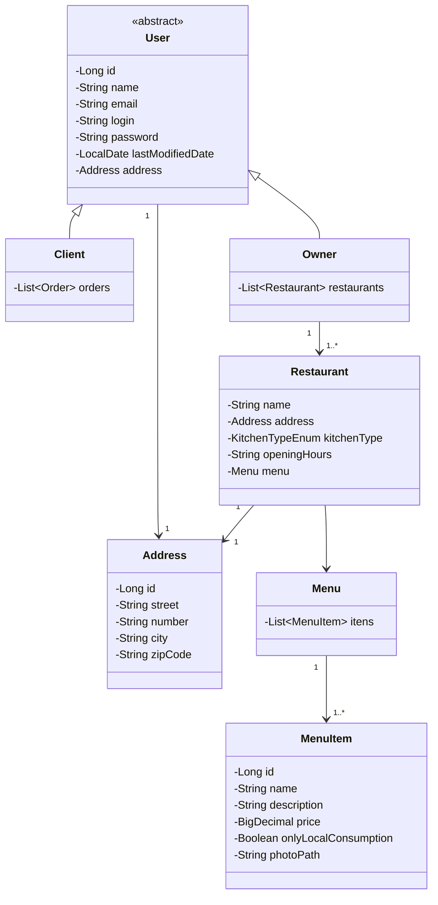
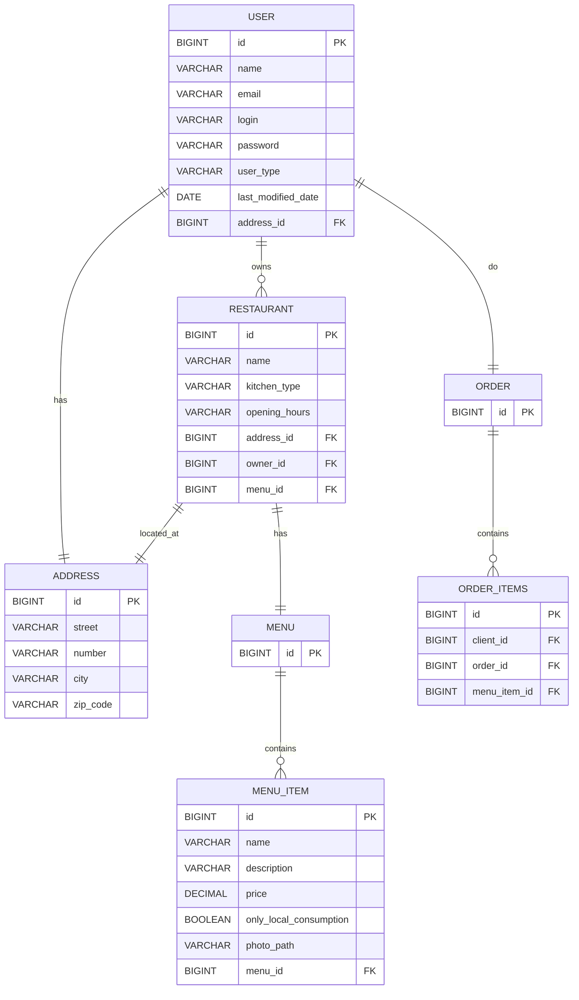

# Tech Challenge II

## Introdução

Este projeto consiste no desenvolvimento de uma API backend para gestão de usuários de uma plataforma compartilhada entre restaurantes, permitindo o cadastro e manutenção de diferentes tipos de usuários, como donos de restaurante e clientes.

O sistema foi desenvolvido como parte do Tech Challenge – Fase 2 do programa de Pós-Graduação em Arquitetura e Desenvolvimento Java (FIAP), com foco na aplicação prática dos conceitos estudados ao longo do curso.

### Objetivo do projeto

## Arquitetura do Sistema

### Descrição da Arquitetura

### Diagrama da Arquitetura

#### Diagrama de classes (domain)

#### Diagrama de entidades

## API – Endpoints

### Tabela de Endpoints

### Exemplos de Requisição e Resposta

## Configuração e Execução

### Docker Compose

## Testes

## Repositório do Código

[https://github.com/HugoOliveiraSoares/tech-challenge-ii](https://github.com/HugoOliveiraSoares/tech-challenge-ii)

## Integrantes

- [Hugo Soares](https://github.com/HugoOliveiraSoares)
- [Lucas Oliveira](https://github.com/lucaso-silva)
- [Matheus Sousa](https://github.com/msousa-s)
